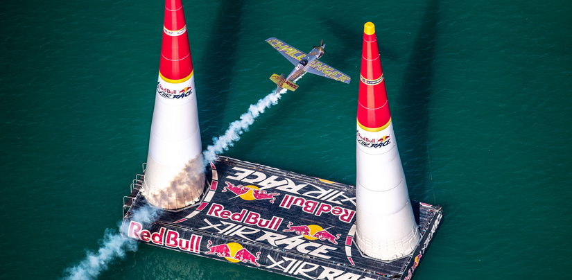
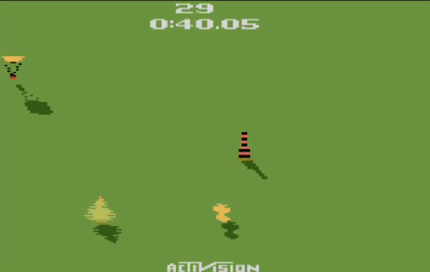
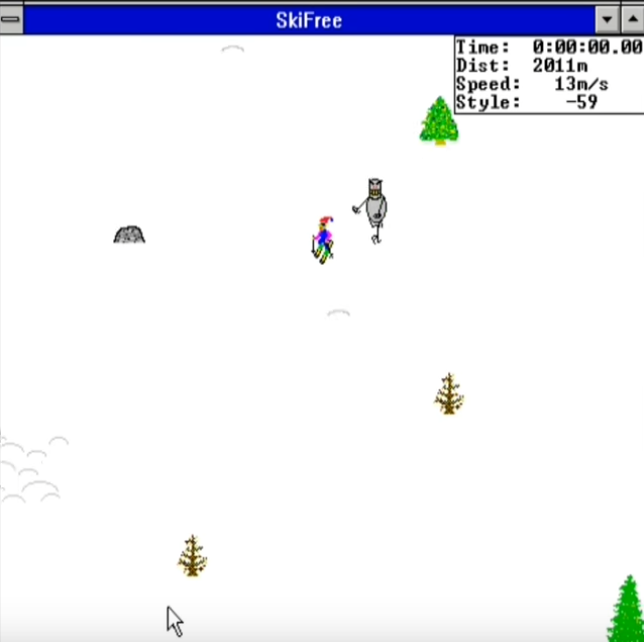
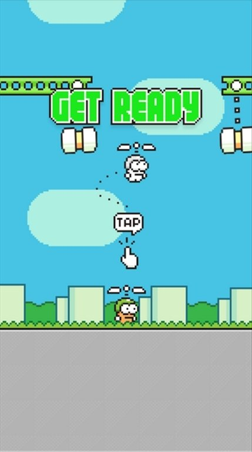
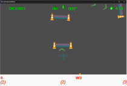
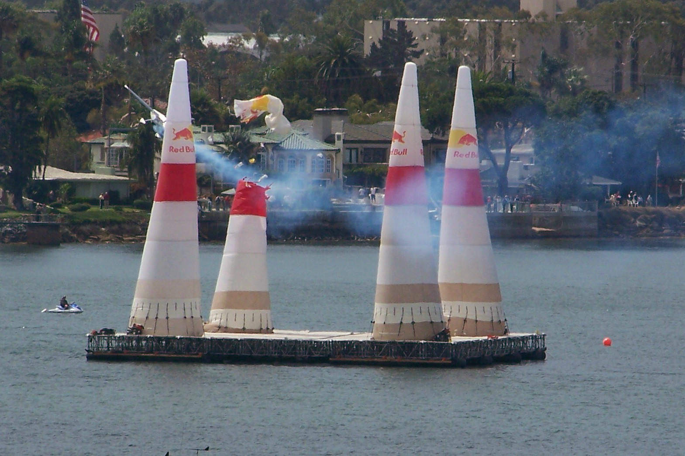

# BaffAttack // GDD

<div style="border: 3px solid #e3e3e3; border-radius: 5px; padding-top: 20px; ">

- Plataforma: PC
- Engine: Godot
- Público alvo: Casual, entusiata de aviação. Amantes de jogos de precisão.
- Controles: mouse ou teclado
</div>

## Game brief


"BaffAttack" é um jogo inspirado na corrida de aviões da Red Bull (Red Bull Air Race World Series). O jogo dura 5 minutos e o objetivo é, 
quando o tempo acabar, ter a maior quantidade de pontos. Como será falado à frente, é possível aumentar ou diminuir a duração do jogo.

## Jogos similares

<div style="display: flex; align-items: flex-start;">

<div>
<h3>Sky Jinx (Atari 2600)</h3>
<p>O Sky Jinx é semelhante ao BaffAttack pelo tema de aviação e pela mecânica de desvio de obstáculos. No Sky Jinx, o jogador pilota um avião em um percurso (na imagem à esquerda, o
avião é o objeto laranja na parte inferior central), desviando de balões e outros obstáculos para chegar ao final no menor tempo possível. A necessidade de reflexos rápidos e 
controle constante da aeronave, assim como a visão top-down, são elementos que Sky Jinx compartilham com BaffAttack.</p>
</div>
</div>

<div style="display: flex; align-items: flex-start; margin-top: 20px;">

<div>
<h3>Ski Free (Windows 3.1)</h3>
<p>Pode parecer um jogo diferente à primeira vista, já que não é na temática de aviões, mas compartilha a mecânica de desvio de obstáculos e percurso pré-estabelecido. No "Ski Free", o jogador controla um esquiador que deve descer uma montanha enquanto evita obstáculos como árvores e outros esquiadores. Igual ao meu jogo, a posição do mouse para esquerda ou direita move o personagem.</p>
</div>
</div>

<div style="display: flex; align-items: flex-start; margin-top: 20px;">

<div>
<h3>Swing Copters (iOS e Android)</h3>
<p>Swing Copters é um jogo bem mais atual que, assim como este jogo, exige precisão e reflexos rápidos. No Swing Copters, o jogador controla um personagem que voa com um helicóptero, desviando de obstáculos que surgem de forma imprevisível. A mecânica de controle do helicóptero, que lembra o controle de um avião, e a necessidade de desviar com precisão de obstáculos em um ambiente de jogo rápido e desafiante. Igual ao
outro projeto do mesmo desenvolvedor, Flappy Bird, o jogo é extremamente simples visualmente, mas extremamente difícil. O BaffaAttack possui três níveis e considero que o nível fácil não muito complicado
para terminar, mesmo para alguém que esteja jogando pela primeira vez.</p>
</div>
</div>


## Tipo

Este é um jogo 2D em terceira pessoa top-down, ou seja, com a vista superior do avião com o terreno em baixo.
Uma câmera virtual mantem o avião no centro da tela com o nariz apontado para a frente. Ou seja,
quando o avião faz uma curva, o cenário que parece girar na direção contrária. Existe uma
suavização na rotação da câmera para que o jogador não tenha uma desorientação espacial, a
imagem de fundo também auxilia nisso.

Também seria possível que a câmera seguisse o jogador sem rotacionar, mas, nos testes preliminares,
esta opção gerou mais confusão. Quando o avião aponta para baixo, os controles de curva ficam
invertidos.

## Controle

É possível aumentar e baixar a velocidade usando o botão "up" e "down" do teclado. O avião também pode realizar curvas. 
Isso pode ser feito usando as setas do teclado; quando a seta é solta, o avião volta para o voo nivelado mantendo a proa constante. Enquanto a tecla da direita é pressionada
o avião aumenta o ângulo de proa em uma razão constante, enquanto a tecla esquerda é pressionada a proa diminui também em razão constante.

A proa pode variar de 0 graus a 359. Ocorre underflow quando o valor fica menor que zero e overflow quando fica maior que 359.

```
                        ╭── +1 ───╮
                        │         v
357        358         359        0        1        2
                        ^         │
                        ╰── -1 ───╯
```

Também é possível usar o mouse; nesse caso, com o cursor na posição central da janela, o voo é mantido nivelado. A distância para a direita ou esquerda determina o quanto a aeronave inclinará para o lado escolhido, permitindo fazer uma curva mais fechada ou aberta. O avião só voltará para o voo nivelado caso o cursor seja recolocado na posição central.

Apenas a coordenada X do mouse importa; a coordenada Y é descartada.

Sendo:

- W: largura da tela;
- R_max: Razão máxima de mudança do ângulo da proa;
- R: Razão atual de mudança do ângulo da proa;
- delta: explicado anteriormente;
- heading: proa atual.

A proa atual é calculada por
`heading += R * delta`

Para se achar o `R` usa-se a posição x do cursor dentro
da tela.




- *(1)* = cursor no canto esquerdo da janela: R = -R\_max
- *(2)* = cursor no meio da janela: R = 0
- *(3)* = cursor no canto direito da janela: R = R\_max

Para valores entre '1 e 2' e '2 e 3' é feita interpolação linear.

## Gameplay

Como na corrida real, o avião deve passar pelos chamados "Air gates", que são duas colunas (pylon na Red Bull Air Race real) pelas quais a aeronave deve passar no meio, exigindo destreza e timing, já que nenhuma parte do avião pode tocar nas colunas. Na competição real, essas colunas são cones de nylon inflados com ar, como balões que não causam danos à aeronave em caso de colisão, apenas o material se rasga, indicando que o avião não passou corretamente.



## Air Gate

Existem dois tipos de Air gates: o largo e o estreito.

### Largo

No largo, o avião deve passar sem tocar em nenhuma parte nas colunas. Caso toque, são descontados 100 pontos. Existe um sentido correto para passar; caso passe no sentido errado, são perdidos 500 pontos.

### Estreito

No Air gate estreito, as regras anteriores também valem, mas uma dificuldade extra é adicionada. Quando estiver passando, o avião deve estar com as
asas inclinadas, mais precisamente com `abs(R) >= R_max / 2`. O significado de R e R\_max foi explicado anteriormente. 
Caso esta regra seja descumprida, são descontados 50 pontos. O desconto é cumulativo, então, caso o avião passe em voo nivelado e atinja um dos cones, são perdidos 150 pontos.

## Power up/down

O jogo dura 5 minutos, mas aparecem em posições aleatórias do mapa "power-ups" de tempos que dão 30 segundos extras caso o avião passe por cima de um. 
Este possui a cor verde. Caso esteja na cor vermelha é descontado 1 minuto. Ambos os power-ups desaparecem ao serem passados.

## ExtraHealth

Existe também um power up que, caso o avião atravesse-o, é dada uma vida extra.

## Caminho
O avião deve seguir a ordem de "airgates" mantendo-se dentro de um caminho pre-estabelecido. A cada delta, a distância do avião
ao caminho é calculada. A partir de um limiar, o jogador
começa a perder ponto em uma razão proporcional à distância do caminho. Caso ele fique muito longe, em poucos segundos
seu escore chega a zero e ele perde.

## Término do jogo

O jogo termina se uma ou mais destas condições ocorrerem:

1) O tempo chegar em zero;
2) os pontos do jogador ficarem iguais a zero ou negativos.

## Dificuldades

Há três níveis de dificuldade no BaffaAttack:

- Easy
- Medium
- Hard

Eles são ajustados por diferentes parâmetros definidos na classe Levels (Levels.cs).
As outras classes buscam na Levels estes parâmetros para se configurarem.

## Parâmetros de Dificuldade

### Speed (Velocidade):
- Velocidade inicial do avião no início do jogo. Ela pode ser ajustada para um
valor dentro dos limites MinSpeed e MaxSpeed.
- Valores:
    - Easy: 150
    - Medium: 200
    - Hard: 300

### MaxSpeed (Velocidade Máxima):
- Descrição: A velocidade máxima que o avião pode atingir.
- Impacto: Limita o quão rápido o avião pode ir. É igual para todos os níveis. Com o avião mais rápido o jogador consegue pegar mais pontos em menos tempo, mas o controle fica mais difícil. Em velocidade superiores a 500 é praticamente impossível controlar o avião.

- Valores:
    - Easy: 900
    - Medium: 900
    - Hard: 900

### MinSpeed (Velocidade Mínima):
- A velocidade mínima que o avião pode manter.
- Impacto: Velocidades mínimas mais altas aumentam a dificuldade, pois o jogador tem menos margem para passar no AirGate. 
No Airgate Narrow uma velocidade maior significa a necessidade de uma maior destreza para inclinar rapidamente a asa e depois nivela-la novamente.

- Valores:
    - Easy: 60
    - Medium: 80
    - Hard: 300


### LoseHealthSpeed (Velocidade de perda de vidas):
- A taxa com que o jogador perde vidas ao ficar muito longe do caminho ou atingir um pylon.
- Valores
    - Easy: 1
    - Medium: 2
    - Hard: 3

Para todos os níveis quando o jogador sai do path o seguinte algorítmo é aplicado:

```
int loseHealthSpeed = Levels.getLevelInfo(Levels.Info.LoseHealthSpeed);
if (distance < 10000)
{
    t = 0;
}
else if (distance < 50000)
{
    if (t > 20)
    {
        t = 0;
        GetNode<Game>("/root/Game").Health -= loseHealthSpeed;
    }
    else
    {
        t++;
    }
}
else if (distance < 100000)
{
    if (t > 20)
    {
        t = 0;
        GetNode<Game>("/root/Game").Health -= loseHealthSpeed + 2;
    }
    else
    {
        t++;
    }
}
else
{
    if (t > 20)
    {
        t = 0;
        GetNode<Game>("/root/Game").Health -= loseHealthSpeed + 4;
    }
    else
    {
        t++;
    }
}
```

### ArrowInterval (Intervalo de Setas):
- A distância entre dois ícones de setas que ajudam o jogador a ficar no caminho.
- Impacto: Intervalos maiores dificultam a manutenção do avião no caminho, pois há menos orientação visual.
- Valores:
    - Easy: 20
    - Medium: 40
    - Hard: 60


### InitialHealth (Vida Inicial):
- O número inicial de vidas do jogador.
- Impacto: Menos vidas aumentam a dificuldade, pois erros são menos tolerados.
- Valores:
    - Easy: 10
    - Medium: 6
    - Hard: 4

## Sistema de pontuação

Existem eventos que aumentam ou diminuem a pontuação e/ou vidas do jogador.

<table>
<tr>
<td style="width: 20%;"><b>Evento</b></td>
<td><b>Consequência</b></td>
</tr>
<tr>
<td>Passar por cima da seta que indica o caminho</td>
<td>Ganha <good>10 pontos</good> independente do nível. Mas quanto mais difícil o nível mais espaçadas ficam as setas</td>
</tr>
<tr>
<td>Passar pelo Airgate no sentido correto</td>
<td>Ganha <good>v - d</good>. Em que "v" é a velocidade atual do avião e 
"d" a distância entre o avião e o path no momento da passagem. Isto incentiva o jogador
a passar pelo centro do AirGate.
</td>
</tr>
<tr>
<td>Passar pelo Airgate ou Airgate Narrow no sentido incorreto.</td>
<td>Perde <bad>uma vida</bad>.
</td>
</tr>
<tr>
<td>Passar pelo Airgate Narrow no sentido correto e com inclinação da asa.
Na seção "Controle" foi falado o significado de "R" e "R_max".

```
abs(R) >= R_max / 2
```

</td>
<td>Ganha <good>3 * (v - d)</good>. Em que "v" é a velocidade atual do avião e 
"d" a distância entre o avião e o path no momento da passagem.
</td>
</tr>
<tr>
<td>Passar pelo Airgate Narrow no sentido correto, mas sem inclinação de asa 

```
abs(R) < R_max / 2
```

</td>
<td>Perde <bad>100 pontos</bad> e uma vida.
</td>
</tr>
<tr>
<td>Atingir um pylon de um AirGate ou AirGate Narrow</td>
<td>Perde <bad>100 * LoseHealthSpeed pontos</bad> e <bad>LoseHealthSpeed vidas</bad>. Sendo LoseHealthSpeed um, dois ou três, dependendo se o nível do jogo é fácil, médio ou difícil, respectivamente.
</td>
</tr>
<tr>
<td>A aeronave ficar a uma distância ao quadrado do path maior que 10000.
É usada a d^2, porque a raiz quadrada é
custosa computacionalmente.</td>
<td>A cada 20 ticks do "process" perde <bad>uma, duas ou três vidas</bad> dependendo se o nível do jogo é fácil, médio ou
difícil, respectivamente.
</td>
</tr>
<tr>
<td>A aeronave ficar a uma distância ao quadrado do path maior que 50000</td>
<td>A cada 20 ticks do "process" perde <bad>três, quatro ou cinco vidas</bad> dependendo se o nível do jogo é fácil, médio ou
difícil, respectivamente.
</td>
</tr>
<tr>
<td>A aeronave ficar a uma distância ao quadrado do path maior que 100000</td>
<td>A cada 20 ticks do "process" perde <bad>cinco, seis ou sete vidas</bad> dependendo se o nível do jogo é fácil, médio ou
difícil, respectivamente.
</td>
</tr>
</table>
